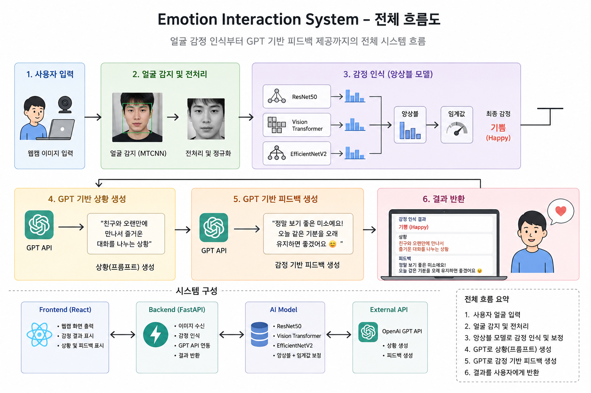

````markdown
# Emotion Interaction System

Hybrid Facial Emotion Recognition with Ensemble, Threshold Calibration, and GPT-based Interactive Feedback

본 프로젝트는 비정형 얼굴 이미지 기반 감정 인식 모델을 활용해  
상황과 감정 결과에 따라 서로 다른 피드백을 제공하는  
감정 기반 인터랙션 시스템입니다.

---

# Project Overview

단순 감정 분류를 넘어,

- GPT 기반 상황 생성
- 감정 기반 피드백 생성
- 반복형 감정 흐름 분석
- 인터랙션 구조 확장

까지 연결하는 것을 목표로 했습니다.

---

# System Workflow



### 전체 흐름

사용자 입력  
→ 얼굴 전처리  
→ Ensemble 감정 분석  
→ GPT 피드백 생성  
→ 반복형 인터랙션 진행

---

# Model Architecture

### Core Models

- Vision Transformer (ViT)
- SigLIP
- EfficientNet
- ResNet50

### Applied Techniques

- Ensemble Voting
- Threshold Calibration
- MTCNN Face Crop
- EXIF Orientation Normalize
- Test Time Augmentation (TTA)

---

# Modeling Process

## 1. Baseline

초기 baseline은 ResNet50 기반 CNN 모델로 시작했습니다.

초기 성능:

```text
val_acc ≈ 0.36
````

CNN 기반 구조만으로는:

* 감정 간 관계 표현
* 미묘한 표정 차이 구분

에 한계가 존재했습니다.

---

## 2. Transformer Backbone Expansion

이후 Transformer 기반 구조를 도입했습니다.

적용 backbone:

* ViT
* SigLIP
* EfficientNet
* ResNet

특히 ViT 구조를 통해:

* 전역 관계 표현
* 얼굴 전체 분위기 학습
* 감정 간 관계 표현

을 강화했습니다.

단일 모델 성능:

```text
≈ 0.72
```

까지 향상되었습니다.

---

## 3. Ensemble Structure

단일 모델 한계를 극복하기 위해:

```text
ViT + SigLIP + EfficientNet + ResNet
```

구조 기반 weighted ensemble을 적용했습니다.

추가 적용:

* threshold calibration
* TTA
* face crop
* augmentation
* learning rate tuning

---

## 4. Misclassification Analysis

주요 오분류 패턴:

```text
panic / sadness → anger
```

특히:

```text
panic → anger : 57 cases
```

문제를 확인했습니다.

---

## 5. Threshold Calibration

anger confidence가 특정 threshold 이하일 경우:

```text
panic / sadness
```

를 재비교하는 후처리 구조를 적용했습니다.

이를 통해:

* anger bias 감소
* panic/sadness balance 개선

효과를 확인했습니다.

---

# Final Performance

| Metric            | Result                          |
| ----------------- | ------------------------------- |
| Final Accuracy    | 0.8358                          |
| Validation Images | 1200                            |
| Classes           | anger / happy / panic / sadness |

### Main Improvements

* panic / sadness confusion reduction
* anger bias mitigation
* threshold-based probability recalibration

---

# Service Implementation

## Main Interaction Screen


### Features

* GPT 기반 상황 제시
* 감정 힌트 기능
* 사용자 이미지 업로드
* 반복형 인터랙션 구조

---

## Emotion Analysis Result


### Output Information

* 기대 감정 출력
* 예측 감정 분석
* confidence score 제공
* 감정 기반 피드백 생성

---

## Feedback Branching


### Feedback Logic

* 감정 일치 여부에 따라
  피드백 방향 변화

* 공감 / 긍정 강화 /
  감정 상태 고려 반응 생성

* 이전 감정 흐름 기반
  상호작용 확장 고려

---

## Final Summary


### Final Interaction Goal

* 반복형 감정 인터랙션
* 감정 흐름 기록
* 종합 감정 피드백 제공
* 사용자 참여 강화

---

# Tech Stack

| Category       | Stack                       |
| -------------- | --------------------------- |
| Frontend       | React + Vite                |
| Backend        | Flask                       |
| AI Framework   | PyTorch / TensorFlow        |
| Model          | ViT / SigLIP / EfficientNet |
| Face Detection | MTCNN                       |
| API            | OpenAI GPT API              |

---

# Environment

| Item    | Version |
| ------- | ------- |
| Python  | 3.10    |
| Node.js | 18+     |
| npm     | 9+      |

---

# Installation

## Backend

```bash
cd emotion-api

python -m venv venv

# Windows
venv\Scripts\activate

pip install -r requirements.txt
```

---

## Frontend

```bash
cd emotion-react

npm install
```

---

# OpenAI API Key Setup

프로젝트 실행 전 `.env` 파일 생성 필요

경로:

```bash
emotion-api/.env
```

내용:

```env
OPENAI_API_KEY=your_openai_api_key
```

---

# Run Project

## Backend 실행

```bash
cd emotion-api

venv\Scripts\activate

python app.py
```

기본 실행 주소:

```bash
http://127.0.0.1:5000
```

---

## Frontend 실행

```bash
cd emotion-react

npm run dev
```

기본 실행 주소:

```bash
http://localhost:5173
```

---

# Requirements

### Python Packages

```bash
flask
flask-cors
openai
python-dotenv
pillow
numpy
torch
torchvision
transformers
tensorflow
opencv-python
facenet-pytorch
```

---

# Project Structure

```bash
emotion-interaction-system
├── emotion-api
│   ├── app.py
│   ├── predict.py
│   ├── models/
│   ├── uploads/
│   └── .env
│
├── emotion-react
│   ├── src/
│   ├── public/
│   └── assets/
│
├── assets
│   ├── workflow.png
│   ├── service_main.png
│   ├── service_result.png
│   ├── service_feedback.png
│   └── service_summary.png
│
└── README.md
```

---

# Reference & Research Continuation

본 프로젝트는 아래 공개 repository의 일부 모델링 구조와
inference pipeline 아이디어를 참고했습니다.

Reference:

* [https://github.com/moneyally/yua-encoder](https://github.com/moneyally/yua-encoder)

다만 프로젝트 진행 과정에서:

* 팀 참여 중단
* 모델 실험 중단
* repository 업데이트 중단

상황이 발생했습니다.

이후:

* 모델 구조 확장
* threshold calibration
* ensemble tuning
* GPT interaction flow
* Flask / React 서비스 구현
* 반복형 인터랙션 구조 설계

등은 별도로 연구 및 확장하여 프로젝트를 진행했습니다.

특히:

* emotion interaction structure
* GPT feedback branching
* multi-turn interaction flow
* threshold-based correction
* UX/UI interaction design

부분은 프로젝트 방향에 맞게 추가 구현했습니다.

---

# Future Improvements

* Multi-turn interaction enhancement
* Emotion flow tracking
* Personalized GPT feedback
* Real-time webcam inference
* Expanded emotion categories

---

# Conclusion

본 프로젝트는 감정을 단순 분류 결과가 아닌
다음 상호작용을 위한 입력값으로 활용하는 것을 목표로 진행되었습니다.

감정 인식 모델과 GPT 기반 피드백을 결합해
사용자 경험 중심 인터랙션 구조를 구현했습니다.

```
```
