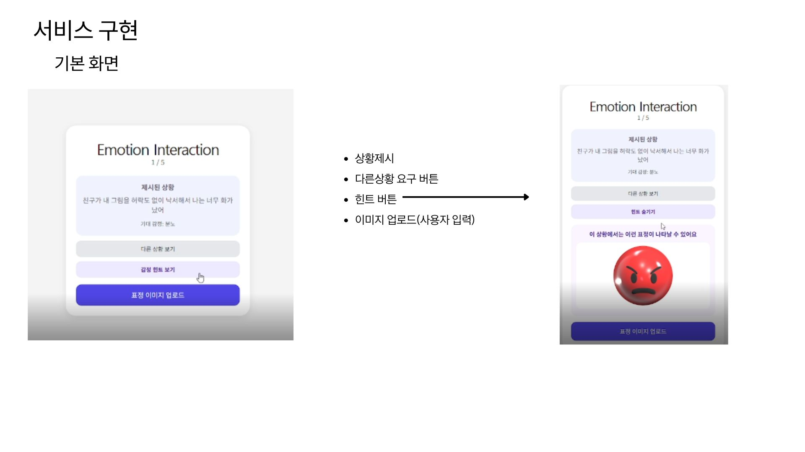
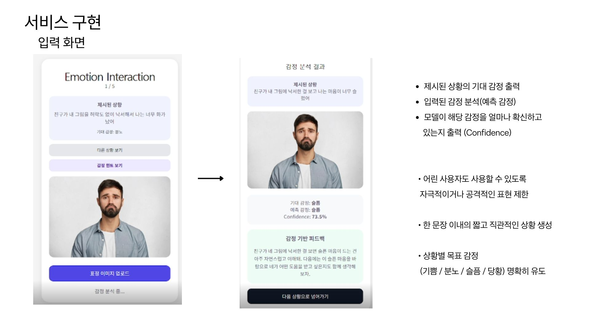
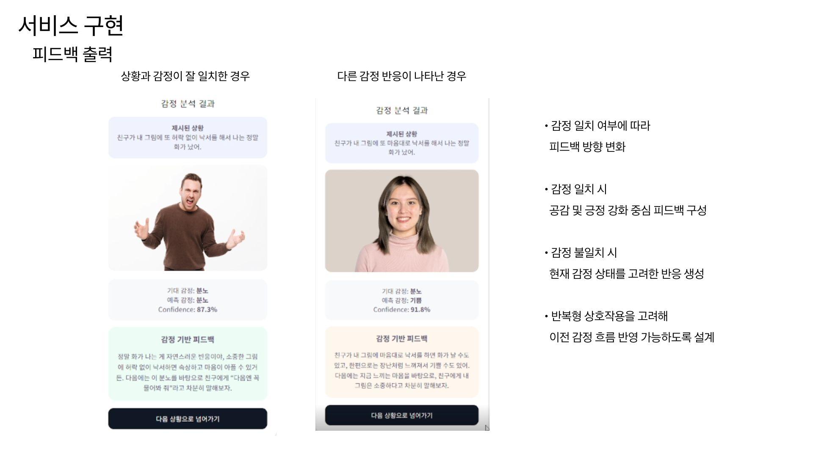
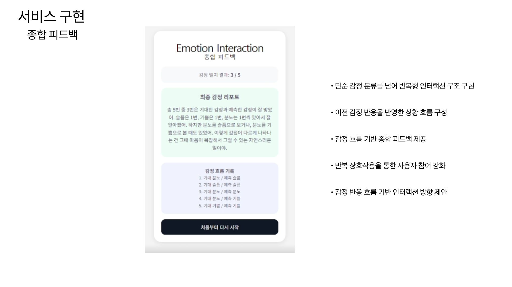

## Service Implementation

### Main Interaction Screen

- GPT 기반 상황 제시
- 감정 힌트 기능
- 사용자 이미지 업로드

---

### Emotion Analysis Result

- 기대 감정 / 예측 감정 출력
- confidence score 제공
- 감정 기반 피드백 생성

---

### Feedback Branching

- 감정 일치 여부에 따라
  피드백 방향 변화

- 공감 / 긍정 강화 /
  감정 상태 고려 반응 생성

---

### Final Summary

- 감정 흐름 기록
- 반복형 인터랙션 구조
- 종합 감정 피드백 제공
